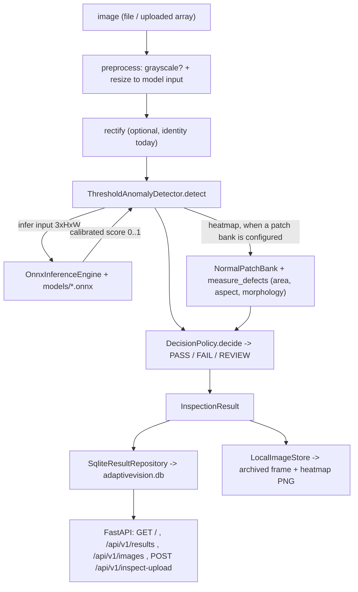
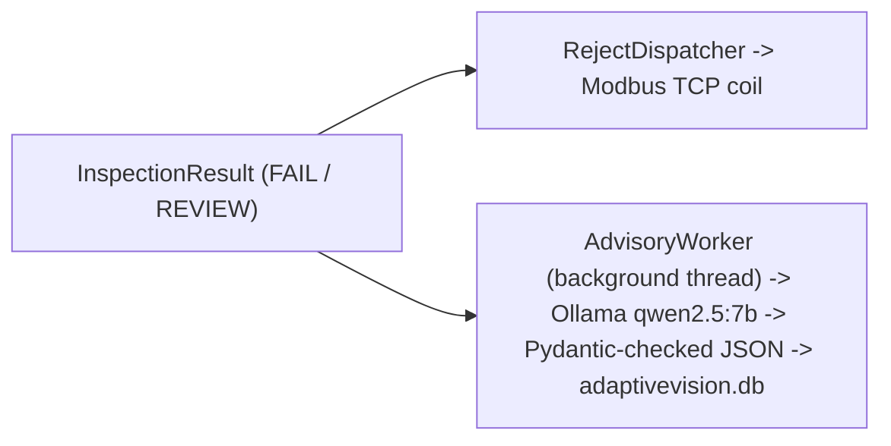

# AdaptiveVision

A Python project that takes an image anomaly-detection model from an offline benchmark to a
small running inspection service: export to ONNX, score a frame, make a fixed PASS/FAIL/REVIEW
decision, store the result, and show it through a web API.

## Overview

The repository has two halves that are meant to connect.

The first half is offline research: fit and evaluate feature-based anomaly-detection methods
(PatchCore, PaDiM, DFM) on several public industrial datasets, in both a per-category setting and a
single-model-per-dataset setting, and record the runs in a SQLite results database.

The second half is a runtime inspection application. It loads an ONNX model exported from that
research, runs one image through preprocessing and ONNX Runtime, turns the raw score into a
calibrated `[0, 1]` value, applies a deterministic rule to decide PASS / FAIL / REVIEW, writes a
traceable record to SQLite, and serves it over a FastAPI dashboard.

I built it because most anomaly-detection code stops at an AUROC number. I wanted to see what the
rest looks like: choosing a threshold, calibrating the score, keeping the decision logic separate
from the model, persisting a result you can audit later, and putting a boundary around an optional
LLM so it can explain a failure without being able to change the verdict.

There is no physical camera and no real factory line. The camera is a file/array driver behind an
interface; a real driver would drop in without changing anything downstream.

## System flow



Optional, off the critical path (an inspection completes and is recorded whether or not these run):



## What this repository shows

- Feature-based anomaly detection implemented from the papers: PatchCore, PaDiM, DFM.
- A benchmark across four datasets and two deployment regimes, with the metrics computed in-repo
  (AUROC, average precision, F1, AUPRO, AUPIMO, plus escape/overkill rates).
- ONNX export with score calibration, checked by running the exported graph back through the same
  inference code the application uses.
- A runtime inspection pipeline with a deterministic decision layer kept separate from the model.
- SQLite traceability and a FastAPI dashboard.
- A narrow applied-AI layer: FAISS image retrieval, and a local-LLM advisory that explains a failure
  without being allowed to change the decision.

## Anomaly detection

Three methods are implemented natively in `training/models.py`, all training-free (a forward pass
over the normal images plus some linear algebra):

- **PatchCore** — a coreset-subsampled memory bank of normal patch embeddings; a frame is scored by
  the distance from each patch to its nearest bank entry.
- **PaDiM** — one Gaussian per patch position, scored by Mahalanobis distance. A position-agnostic
  ("pooled") variant is used for material that is not camera-aligned (Severstal steel strip).
- **DFM** — PCA reconstruction error over globally pooled features; a cheap control that tells you
  whether the defect signal is global.

Backbones come from `timm` and are frozen: ResNet / WideResNet / ConvNeXt / EfficientNet, and the
DINOv2 ViT-S/B/L models. The exported production models use PatchCore or DFM on a DINOv2 or
WideResNet backbone.

`training/models.py` also contains a native implementation of **Dinomaly** (a frozen DINOv2 encoder
with a reconstruction decoder, one model per dataset instead of one per category). It is
research-only here: it needs gradient training and a GPU, it has no ONNX export path, and it is not
used by the runtime application. The benchmark can also delegate ~25 further methods to
[Anomalib](https://github.com/open-edge-platform/anomalib) when that package is installed; several
of those adapters currently fail to run (see `docs/RESULTS.md`).

## Benchmarking

Datasets used, none of which are included in this repository:

- [MVTec AD](https://www.mvtec.com/company/research/datasets/mvtec-ad) (15 categories)
- [VisA](https://github.com/amazon-science/spot-diff) (12 objects)
- [KolektorSDD2](https://www.vicos.si/resources/kolektorsdd2/)
- [Severstal Steel Defect Detection](https://www.kaggle.com/c/severstal-steel-defect-detection)

The sweep runs each method against each dataset config in a per-category ("one-class") regime and a
single-model-per-dataset ("multi-class") regime, over three seeds, and writes every run to a SQLite
database. The committed summary (`docs/benchmarks/leaderboard.md`) covers 22 methods over 29 dataset
configurations: about 3,400 runs completed, and roughly 650 failed — almost all of them the optional
Anomalib adapters. `docs/RESULTS.md` explains the methodology and picks out a few results.

## Runtime and deployment

The path from research to a running model:

PyTorch fit (offline) → `training/export.py` traces backbone + scorer + score calibration into one
ONNX graph with a static `(3, H, W)` input → `OnnxInferenceEngine` loads it under ONNX Runtime
(CPU by default) → `ThresholdAnomalyDetector` compares the calibrated score to a per-recipe
threshold → `DecisionPolicy` produces the verdict → the result is persisted.

Score calibration fits a sigmoid on the raw scores of held-out **normal** images only, so the
exported output is a comparable `[0, 1]` value and the labeled test split never touches it.

`training/export.py` also has a dynamic (weights-only) INT8 quantization path. It includes a fix
specific to memory-bank methods: quantizing an already-fitted PatchCore leaves the bank in fp32
while queries become INT8, which collapses accuracy, so the bank is rebuilt in the quantized
model's own feature space. Results are in `docs/benchmarks/quantization_comparison.md`. There is no
TensorRT, FP16, static INT8, or QAT.

## Applied-AI components

These are smaller than the rest and clearly bounded.

### FAISS retrieval

`FaissRetrievalIndex` (in `src/adaptivevision/explanation.py`) is a flat index over image embeddings
(the `embedding` output of an exported model), cosine similarity, with a JSON metadata sidecar that
refuses to load an index built with a different embedding model. It is used to look up similar past
defects. It is wired into the standalone research dashboard (`training/dashboard_app.py`), **not**
into the main inspection loop — the production `AdvisoryWorker` passes no retrieval context.

### Local-LLM advisory

On a FAIL or REVIEW verdict, a background worker sends the inspection evidence (anomaly score,
heatmap region, measured defect geometry) to a local [Ollama](https://ollama.com) model
(`qwen2.5:7b` by default). The response must satisfy a Pydantic schema
(`defect_classification`, `confidence_score`, `root_cause_hypothesis`, `recommended_actions`).

The important boundary: the deterministic verdict is decided **before** the LLM runs, `severity` is
not a field the model is asked for, and `advise()` raises if the returned report's severity differs
from the evidence. If Ollama is unavailable or the response is malformed, it retries once and then
returns a deterministic text report. This is a single structured-output prompt with a fallback — not
an agent, no tool calling, no retrieval in the loop.

The real `qwen2.5:7b` path has been run locally and produces a non-fallback report. The automated
tests cover the mocked-client and fallback paths, not real Ollama inference.

## Verified status

Checked on the development machine on 2026-09-10 (Python 3.11, CPU):

| Component | Status |
|---|---|
| `python scripts/run_station.py`, good image | Verified — verdict PASS |
| `python scripts/run_station.py`, defective image | Verified — verdict FAIL |
| ONNX Runtime inference (PatchCore + DINOv2-ViT-B/14) | Verified |
| SQLite persistence + image archive | Verified |
| `python run_dashboard.py` + `/health` + `/api/v1/results` | Verified |
| Teach-mode upload (`POST /api/v1/inspect-upload`) | Verified — FAIL, score, heatmap region, measured defect region, archived frame + heatmap |
| Local LLM advisory (`qwen2.5:7b`, `is_fallback: false`) | Verified locally; not in the automated tests |
| Production test suite | Verified — 528 passed, 95.42% branch coverage |
| `mypy` (strict, `src` + `scripts`) | Verified — clean |
| `ruff check .` | Verified — clean |
| FAISS retrieval | Implemented and unit-tested; not in the main inspection loop |
| Docker / Prometheus / Grafana config | Present, not verified (no Docker on the dev machine) |
| PLC reject over Modbus TCP | Code path runs; degrades cleanly when no PLC answers |

## Results at a glance

- 528 production tests passing, 95.42% branch coverage, `mypy --strict` and `ruff` clean.
- The demo model, PatchCore on DINOv2-ViT-B/14, one-class on **MVTec AD `bottle`**: image-level
  AUROC 0.9997 (from `models/patchcore_dinov2_vitb14__mvtec_bottle.json`).
- The native multi-class model (Dinomaly, DINOv2-ViT-B/14): mean image AUROC 0.977 across the 27
  MVTec + VisA configurations, from a single fitted model per dataset — research-only, not exported.
- 29 models exported to ONNX (their manifests are in `models/*.json`; the binaries are ~14 GB and
  stay local).

See `docs/benchmarks/` for the full tables.

## Quick start

There are two dependency sets. See `docs/SETUP.md` for details.

**Runtime** (the inspection app and its tests): Python 3.11, then

```bash
pip install -e ".[dev,inference,intelligence]"
```

This installs numpy, opencv, SQLAlchemy, FastAPI, ONNX Runtime, faiss-cpu, the Ollama client, and
the test/type tooling.

**Research** (`training/`): additionally

```bash
pip install -r training/requirements.txt   # torch, timm, scikit-learn, scipy, pandas, ...
```

## Minimal demo

```bash
python scripts/run_station.py
```

With no configuration this boots a walking skeleton (null camera, no model) and every part passes.
To run real inference you need an exported ONNX model and, for the RGB model, a sample image — both
excluded from Git. With those in place and a `.env` pointing at them (see
`.env.example`), the same command loads the model, scores one MVTec bottle image, prints a JSON log
line with the verdict, and writes a row to `adaptivevision.db`. Point `ADAPTIVEVISION_DEMO_IMAGE_PATH`
at a `broken_*` image to see a FAIL.

To regenerate the demo model yourself (needs the research dependencies and MVTec AD):

```bash
python -m training.export export --method patchcore_dinov2_vitb14 --dataset mvtec/bottle
```

## Dashboard

```bash
python run_dashboard.py
# http://127.0.0.1:8000/
```

Serves the persisted inspection records, archived frames, per-record advisory reports, and a
teach-mode panel that runs an uploaded image through the same pipeline.

## Repository layout

```
src/adaptivevision/   the inspection application (16 modules): camera, engine, metrology,
                      decision, orchestration, storage, api, explanation, drift, communication, ...
training/             offline research: models.py, data.py, sweep.py, evaluate.py, export.py, store.py
scripts/              entry points: run_station.py, run_api.py, build_patch_bank.py, evaluate_kpis.py, mock_plc.py
tests/                528 tests (unit / integration / e2e / performance / regression)
configs/, recipes/    AOI settings (config.yaml) and one product recipe (demo-bottle.json)
deploy/               Dockerfile + docker-compose + Prometheus/Grafana config (not verified)
docs/                 ARCHITECTURE.md, SETUP.md, RESULTS.md, benchmarks/
models/               29 exported-model manifests (*.json); the .onnx binaries are not in Git
```

## Testing

```bash
pytest -q          # 528 passed, 95.42% branch coverage (with the runtime deps installed)
mypy               # strict, src + scripts, clean
ruff check .       # clean
```

`training/tests/` needs the research dependencies (torch) and is not run by the default command.
The nine tests that need an exported ONNX model or a dataset skip automatically when those are not
present, so a fresh clone stays green (519 pass, 9 skip). `.github/workflows/ci.yml` runs `ruff`,
`mypy`, and that subset on Python 3.11.

## Limitations

- No physical camera or factory line. Preprocessing rectification is an identity copy; golden-
  reference alignment returns a fixed pose. Both are placeholders behind their interfaces.
- The `pixel_to_micron` value in `configs/config.yaml` is a placeholder, so defect areas reported in
  square microns are illustrative, not measured.
- A PLC is not connected during local runs; the reject dispatch logs and continues.
- Several utility modules (drift detection, the metrics registry, SPC, calibration hot-swap, a
  threaded frame buffer, a failure-retry buffer, the cycle watchdog's check, MQTT) are implemented
  and unit-tested but not wired into the running station. The `/metrics` endpoint responds but is
  empty.
- FAISS retrieval is not part of the main inspection loop (only the research dashboard).
- The real Ollama path works locally but is not covered by the automated tests.
- The Docker / Prometheus / Grafana stack has configuration but has not been built or run.
- About 650 benchmark runs failed, almost all of them optional Anomalib adapters.
- The dimensional `MetrologyInspector` has no measurement source and is not used.

## Tech stack

Python 3.11, PyTorch and timm (research), ONNX and ONNX Runtime, NumPy, OpenCV, scikit-learn and
SciPy (metrics), FAISS, Pydantic, Ollama (client), SQLAlchemy + SQLite, FastAPI + Uvicorn.
Development: pytest, mypy, ruff, black, pre-commit.

## References

- Roth et al., *Towards Total Recall in Industrial Anomaly Detection* (PatchCore), CVPR 2022.
- Defard et al., *PaDiM: a Patch Distribution Modeling Framework for Anomaly Detection and
  Localization*, ICPR 2021.
- Ahuja et al. / Rippel et al., deep-feature modeling for anomaly detection (DFM).
- Guo et al., *Dinomaly: The Less Is More Philosophy in Multi-Class Unsupervised Anomaly Detection*,
  CVPR 2025.
- Oquab et al., *DINOv2: Learning Robust Visual Features without Supervision*, 2023.
- Bergmann et al., *The MVTec Anomaly Detection Dataset*; Zou et al., *SPot-the-Difference* (VisA);
  Božič et al., KolektorSDD2; Severstal Steel Defect Detection (Kaggle).
- [Anomalib](https://github.com/open-edge-platform/anomalib) (Apache-2.0), used as an optional
  benchmark backend.
- `timm` (`pytorch-image-models`) for the pretrained backbones.

The anomaly-detection methods here are implemented from the papers above; they are not copied from
the authors' reference code.

## License

MIT — see [LICENSE](LICENSE). Third-party dependencies and the datasets keep their own licenses.
